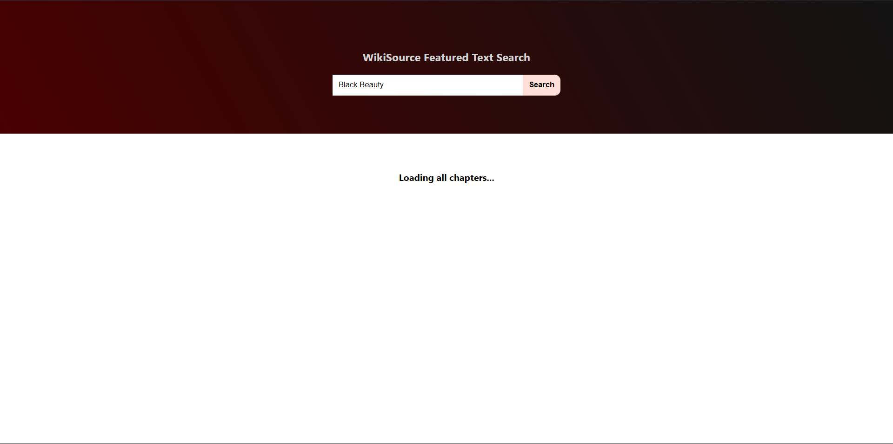
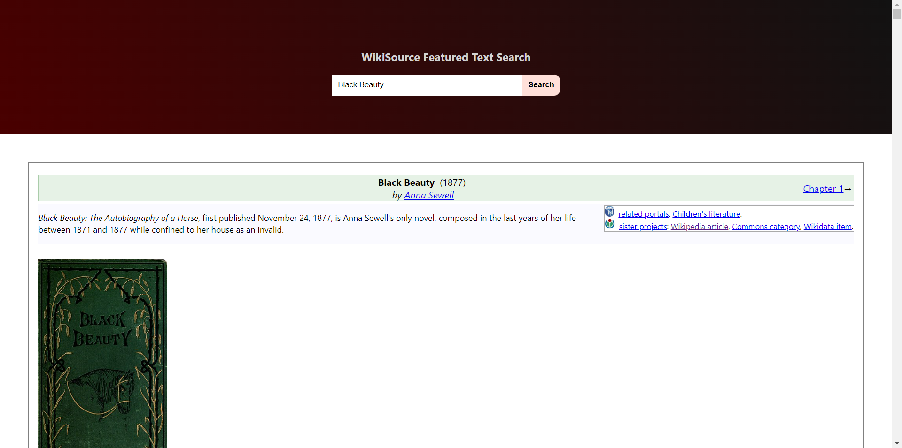

# MediaWiki Tool

This is a tool created to search and compile any featured text from [this portal](https://en.wikisource.org/wiki/Category:Featured_texts) on the WikiSource website. 

## Tech Stack
The user interface was built in ReactJS and the backend server was made with NodeJS. The frontend code can be found [here](https://github.com/Parthiv-M/mediawiki-tool/tree/master/client) and the server code resides [here](https://github.com/Parthiv-M/mediawiki-tool/tree/master/server)

## External Libraries Used
- [`axios`](https://www.npmjs.com/package/axios): Was used to make requests to the server and the WikiMedia API
- [`jsdom`](https://www.npmjs.com/package/jsdom): Was used to parse the HTML response from the WikiMedia API effectively

## How it Works
- It takes the title of the work from the user.
- The frontend makes a `GET` request to the server (on the `/api/getchapters/:title` route) where the server queries the WikiMedia API to fetch the page of the relevant work, if it exists.
- Any given work may contain multiple chapters or pages. 
- JSDOM is used to parse the HTML returned from the WikiMedia API and extract the relevant page titles corresponding to the subsequent chapters.
- The same process is continued till the HTML of all chapters are obtained, page-wise. 
- The HTML responses of all chapters are concatenated before being sent to the frontend, where it is displayed as a single document.    

## Screenshots
The user is greeted with a screen where the title can be entered

The loading screen on the frontend when the server is querying the WikiMedia API and collating the various chapters

The final output where all the chapters are displayed as a single document
